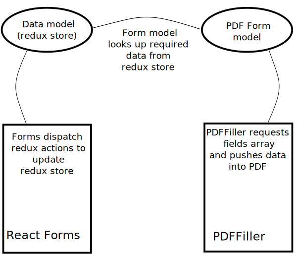

# Project Architecture

Thank you for your interest in this project. The below should summarize the general design framework used in this project, and hopefully guide you in understanding the code and getting ready to contribute to the project. If anything at all is unclear please join the discord linked on the readme and feel free to ask any questions you might have.

## Stack and developer requirements

This project uses TypeScript and is built with [NPM 8][npm-install].

## Desktop application requirements

The desktop application is built with [Tauri][tauri-root], see [this reference for setting up your environment for Tauri](https://tauri.studio/en/docs/getting-started/intro/#setting-up-your-environment). While this project does not have any significant rust code yet, this may be built out in the future. Running the application as a desktop app requires [Rust][rust-root] installed.

Specific architecture setup requirements we have run into are:

### Windows

For Windows users, please install [Microsoft Edge WebView2][webview2] before running the desktop application.

### Linux

Running the desktop version requires at least the following to be installed:

```
libssl-dev
libgtk3-dev
libgtk-3-dev
libsoup2.4-dev
webkit2gtk-driver
libwebkit2gtk-4.0-dev
```

## Project design

There are four main concerns separated in this project:

1. Data must be collected from users (react forms)
2. Collected data must be stored in a data model (via redux dispatched actions only)
3. Tax forms must access data model to calculate data required by each form
4. That calculated data must be must be rendered into a PDF file when the user exports their 1040 and attachments.

Data flows in only this one direction, from 1 to 4.



Note the information in the datamodel is automatically synced to browser's LocalStorage so the data is available when the user closes and reopens the page.

### Data model

The root schema of data stored from form submissions is defined in [src/redux/data.ts](../src/redux/data.ts) as:

```ts
export interface Information {
  f1099s: Supported1099[]
  w2s: IncomeW2[]
  refund?: Refund
  taxPayer: TaxPayer
}
```

- **f1099s**: An array of all 1099s that have been added. Note this includes 1099-B which goes to Schedule D, 1099-INT which goes to Schedule B, and 1099-DIV which provides data that goes to both Schedule B and Schedule D. This confusion is not needed at this level of the data model. Later when PDFs are created, the correct data can be accessed by the code managing those schedules.
- **w2s**: All W-2s that have been added for both primary taxpayer and spouse
- **refund**: Direct deposit information
- **taxPayer**: Basic information about user's name, SSN, dependents, spouse

### PDF Export

Supported federal and state forms are included in the source control of this repository.

- [src/irsForms/](../src/irsForms/) includes ts models for all federal forms that can be filled by this project. The PDFs are also included in this project at [pubilc/forms](../public/forms). Each of these form definitions implements this interface:

```ts
type Field = string | number | boolean | undefined
export default interface Fill {
  fields: () => Field[]
}
```

This array of `fields` must line up exactly with the fields expected by the PDF that the data will be filled into. Getting this data to line up exactly is error prone and tedious. The only type checking we can do between the PDF and our data is to verify if a field expects a boolean value (checkbox), or a text + numeric value.

In order to help this error prone process, there's also a script that should be used to add a new form. See the guide for contributing a new form below.

- [src/stateForms](../src/stateForms) includes ts models for all state forms that can be filled. They also implement the same interface.

## Guide for contributing a new form implementation

- Add new data schema if needed
  - Interfaces in [src/redux/data](../src/redux/data.ts) may need to be expanded if you're collecting additional data from the user
- For a new UI form that needs its own page, add to routes in [Main.tsx](../src/components/Main.tsx)
- A UI form can push new data into the state using Redux actions. Define your new action in [src/redux/actions.ts](../src/redux/actions.ts), and add your state updates to [src/redux/reducer.ts](../src/redux/reducer.ts)
- If there is a new attachment to the 1040:

  - The blank form goes in `public/forms/`. The locations of all supported attachments and logic about what attachments are required, is in [fillPdf.ts](../src/pdfFiller/fillPdf.ts).
  - The data model for the PDF goes in [irsForms](../src/irsForms), and implements the `Form` interface as above. There is a script we use to generate a base implementation of the form. To generate this base implementation, run

  ```
  npm run formgen ./public/forms/<name-of-form>.pdf > ./src/irsForms/<name-of-form>.ts
  ```

  This will provide a function for each field in the PDF. At this point you should have a compilable file that needs the implementations for all those functions filled in.

[npm-install]: https://www.npmjs.com/get-npm
[tauri-root]: https://tauri.studio/
[rust-root]: https://www.rust-lang.org/
[webview2]: https://developer.microsoft.com/en-us/microsoft-edge/webview2/
