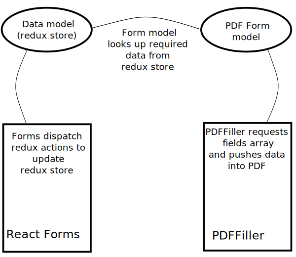

# Project Architecture

Thank you for your interest in this project. The below should summarize the general design framework used in this project, and hopefully guide you in understanding the code and getting ready to contribute to the project. If anything at all is unclear please join the discord linked on the readme and feel free to ask any questions you might have.

## Project design

There are four main concerns separated in this project:

1. Data must be collected from users (react forms)
2. Collected data must be stored in a data model (via redux dispatched actions only)
3. Tax forms must access data model to calculate data required by each form
4. That calculated data must be must be rendered into a PDF file when the user exports their 1040 and attachments.

Data flows in only this one direction, from 1 to 4.



Note the information in the datamodel is automatically synced to browser's LocalStorage so the data is available when the user closes and reopens the page.

### Data model

The root schema of data stored from form submissions is defined in [src/redux/data.ts](../src/redux/data.ts) as:

```ts
export interface Information {
  f1099s: Supported1099[]
  w2s: IncomeW2[]
  refund?: Refund
  taxPayer: TaxPayer
}
```

- **f1099s**: An array of all 1099s that have been added. Note this includes 1099-B which goes to Schedule D, 1099-INT which goes to Schedule B, and 1099-DIV which provides data that goes to both Schedule B and Schedule D. This confusion is not needed at this level of the data model. Later when PDFs are created, the correct data can be accessed by the code managing those schedules.
- **w2s**: All W-2s that have been added for both primary taxpayer and spouse
- **refund**: Direct deposit information
- **taxPayer**: Basic information about user's name, SSN, dependents, spouse

### PDF Export

Supported federal and state forms are included in the source control of this repository. Blank PDFs live under [public/forms/](../public/forms/) (per tax year). TypeScript for each form extends [`Fill`](../src/core/pdfFiller/Fill.ts) in [src/core/pdfFiller/](../src/core/pdfFiller/): every implementation provides `fields()` (positional values). **Y2024+** federal IRS forms also implement optional `fillInstructions()` with explicit AcroForm field names and kinds; export uses [`fillPdfFromFill`](../src/core/pdfFiller/fillPdf.ts), which prefers those instructions and otherwise derives them from the PDF field order (legacy bridge for **Y2020–Y2023**). JSON schemas under `schemas/<year>/` describe PDF fields for contract tests and CI.

For the full pipeline (types, diagram, tooling, tests), see [pdf-form-filling.md](pdf-form-filling.md).

Federal form logic for a given year lives under [`src/forms/<year>/irsForms/`](../src/forms/Y2024/irsForms/). State forms for that year live under [`src/forms/<year>/stateForms/`](../src/forms/Y2024/stateForms/). Shared PDF utilities and the `Fill` base class are in [`src/core/pdfFiller/`](../src/core/pdfFiller/).

## Guide for contributing a new form implementation

- Add new data schema if needed
  - Interfaces in [src/redux/data](../src/redux/data.ts) may need to be expanded if you're collecting additional data from the user
- For a new UI form that needs its own page, add to routes in [Main.tsx](../src/components/Main.tsx)
- A UI form can push new data into the state using Redux actions. Define your new action in [src/redux/actions.ts](../src/redux/actions.ts), and add your state updates to [src/redux/reducer.ts](../src/redux/reducer.ts)
- If there is a new attachment to the 1040:

  - The blank form goes in `public/forms/<year>/irs/`. Attachment selection and fill orchestration are in [fillPdf.ts](../src/core/pdfFiller/fillPdf.ts).
  - The TypeScript for the PDF goes under `src/forms/<year>/irsForms/` (see [pdf-form-filling.md](pdf-form-filling.md) and [adding_year.md](adding_year.md)). Generate a skeleton with:

  ```
  npm run formgen ./public/forms/<year>/irs/<tag>.pdf > ./src/forms/<year>/irsForms/FXXXX.ts
  ```

  Then implement the form’s calculations and wire `fillInstructions()` as needed. For adding a whole new tax year, follow [adding_year.md](adding_year.md).

[npm-install]: https://www.npmjs.com/get-npm
[tauri-root]: https://tauri.studio/
[rust-root]: https://www.rust-lang.org/
[webview2]: https://developer.microsoft.com/en-us/microsoft-edge/webview2/
