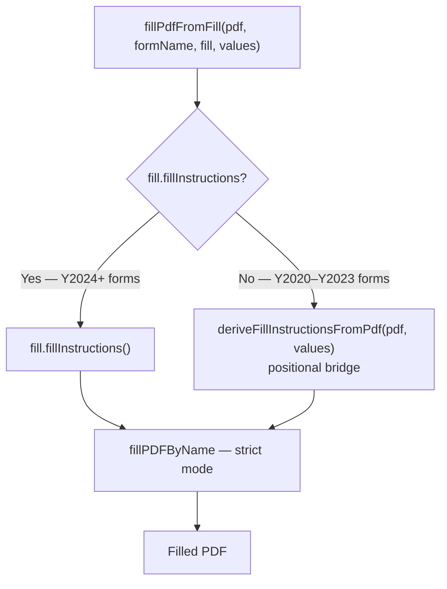

# Name-based PDF form filling

## Summary

Replaces the positional index-based PDF form filling strategy with an explicit field-name-based system, eliminating a class of silent data corruption bugs that occurred whenever the IRS updated form layouts.

---

## Motivation

The previous approach paired `Fill.fields()` array values with PDF AcroForm fields by position. Any IRS update that added, removed, or reordered fields caused values to silently land in the wrong fields — with no runtime error, no test failure, and no indication to the user.

---

## Changes

### New Infrastructure

- **`FillInstruction` type** (`src/core/pdfFiller/index.ts`) — discriminated union of `text`, `checkbox`, and `radio` variants, each carrying an explicit field name and typed value.
- **`fillPDFByName`** (`src/core/pdfFiller/fillPdf.ts`) — low-level filler using pdf-lib's type-specific getters (`getTextField`, `getCheckBox`, etc.). Supports two validation modes:
  - `strict` — throws on missing field, duplicate mapping, or type mismatch (used in CI)
  - `warn` — collects warnings and continues (useful during migration)
- **`fillPdfFromFill`** — orchestration entry point. Dispatches to `fillPDFByName` with native instructions when available; falls back to the legacy positional bridge otherwise.
- **`fillInstructions?(): FillInstructions`** added to `Fill` base class — currently optional while migration is in progress; intended to become abstract once all Y2024 forms are complete.

### Fill Dispatch Flow

`fillPdfFromFill` is the single entry point for all PDF filling. It routes each form to the appropriate path based on whether `fillInstructions()` is implemented:



Both paths converge on `fillPDFByName`, so all error detection (duplicate names, type mismatches, missing fields) applies uniformly regardless of which year's form is being filled.

### Y2024 Form Migration

All 41 Y2024 forms now implement `fillInstructions()` with explicit field names. Y2024 is the first tax year with a fully name-based schema — each form has a corresponding `schemas/Y2024/<tag>.json` that captures every AcroForm field name and type, used by contract tests and CI.

### Legacy Compatibility

Y2020–Y2023 forms are **not modified** by this change. They continue to implement only `fields()`, and `fillPdfFromFill` transparently bridges them through `deriveFillInstructionsFromPdf`, which pairs each positional `fields()` value with the corresponding AcroForm field in the PDF. These forms flow through `fillPDFByName` identically to Y2024 forms — they just arrive there via the bridge rather than via explicit field names.

| Tax year    | Fill path                                        | Schema                                                               |
| ----------- | ------------------------------------------------ | -------------------------------------------------------------------- |
| Y2020–Y2023 | `fields()` → positional bridge → `fillPDFByName` | No JSON schema; field order is the implicit contract                 |
| Y2024       | `fillInstructions()` → `fillPDFByName` directly  | `schemas/Y2024/<tag>.json` — explicit AcroForm field names and types |
| Y2025+      | Same as Y2024                                    | `schemas/Y2025/<tag>.json` (generated via `npm run extract-schema`)  |

### Tooling

- **`npm run formgen <pdf>`** — generates a skeleton form class from a PDF, emitting both `fields()` (legacy placeholder) and a fully populated `fillInstructions()`.
- **`npm run extract-schema <pdf> [output-dir]`** — extracts AcroForm metadata to a JSON schema manifest for use in contract tests and CI.

### Testing

- **Equivalence test** (`fillEquivalence.test.ts`) — for each Y2024 form: asserts instruction count equals the PDF's AcroForm field count, instruction `kind` values match the PDF field types, and a strict-mode fill produces zero warnings; then snapshots the sorted set of extractable field names for regression detection. For F1040 specifically: validates that native `fillInstructions()` values agree with bridge-derived values field-by-field (name, kind, and normalized numeric value) across property-test runs.
- **Contract tests** (`contractTests.test.ts`) — validate three invariants per form:
  1. Every `fillInstructions()` field name exists in the extracted PDF schema.
  2. Every PDF schema field is either handled or explicitly allowlisted.
  3. Each `FillInstruction.kind` matches the PDF schema field type.
- **CI** (`.github/workflows/ci.yml`) — runs `extract-schema` before tests; any field name drift fails the build immediately.

---

## What This Fixes

| Before                                              | After                                                     |
| --------------------------------------------------- | --------------------------------------------------------- |
| IRS reorders fields → wrong values silently written | Field names survive reordering; missing name → loud error |
| Type mismatch undetected at fill time               | Explicit `kind` catches IRS field type changes            |
| Positional bugs only discoverable via manual review | Contract tests + CI catch schema drift on every commit    |
| No visibility into which field a value targets      | Field names in code match the PDF AcroForm exactly        |

---

## Upgrade Path for New Forms (Y2025+)

```bash
# 1. Extract schema
npm run extract-schema public/forms/Y2025/irs/fXXXX.pdf schemas/Y2025

# 2. Generate skeleton
npm run formgen public/forms/Y2025/irs/fXXXX.pdf > src/forms/Y2025/irsForms/FXXXX.ts

# 3. Populate field values, add extract-schema line to CI
```

---

## Breaking Changes

None. The legacy `fields()` path continues to work for Y2020–Y2023 forms without modification.
